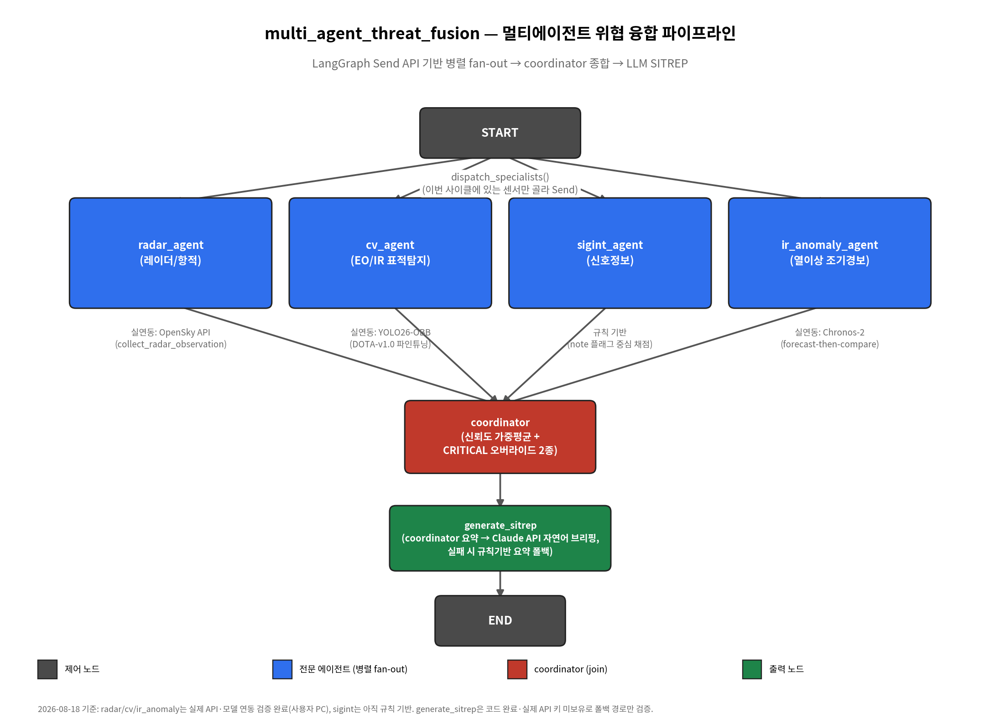

# multi_agent_threat_fusion

`sitrep_fusion_agent`(단일 파이프라인 LangGraph 프로젝트)의 다음 단계로, 멀티에이전트 구조 +
시계열 이상탐지(비지도 학습 경험 보강)를 목표로 하는 신규 프로젝트입니다.

## Phase 1 — IR 이상탐지 에이전트 프로토타입 ✅ 완료 (2026-08-14~15)

멀티에이전트 뼈대를 만들기 전에, 가장 새로운 기술 요소인 **시계열 이상탐지(Chronos-2 기반
zero-shot forecast-then-compare)**가 실제로 동작하는지 먼저 단독으로 검증했습니다.

- `synthetic_thermal_series.py`: 위성이 발사장을 주기적으로 관측한다고 가정한 합성 열이상
  시계열 생성기. 24시간 주기 베이스라인(태양열 영향 흉내) + 로켓엔진 점화 스파이크(강) +
  정비용 소규모 발열(약, 애매한 경계 사례) 2종의 이상 이벤트를 주입.
- `ir_anomaly_agent.py`: forecast-then-compare 이상탐지 로직. `Forecaster` 인터페이스를
  분리해서 실제 운영용(`ChronosForecaster`, Chronos-2 사용)과 검증용(`MockForecaster`,
  이동평균+표준편차 기반 통계 모델)을 교체 가능하게 설계.

**결론**: 샌드박스에선 huggingface.co 접속이 막혀 `MockForecaster`로 배관(구조)만 검증했고,
사용자 PC에서 실제 `ChronosForecaster`(Chronos-2)로 재검증까지 완료. 사건 단위 탐지율
2/2(100%), 탐지 지연 0스텝 — "zero-shot 시계열 파운데이션 모델로 이상탐지가 실제로 되는가"
라는 핵심 가설 검증 완료. (point-level recall이 낮은 건 1-step-ahead 예측 특성상 정상 —
조기경보 목적엔 오히려 이상적인 동작. 상세 수치는 프로젝트 진행기록 참고.)

## Phase 2 — 멀티에이전트 뼈대 설계 ✅ 완료 (2026-08-18)

### 목표와 설계 방향

Phase 1까지는 "이상탐지 로직 하나"만 검증했습니다. Phase 2의 목표는 이걸 **레이더/CV/SIGINT
전문 에이전트와 나란히, 병렬로 동시에 실행하고, 그 결과를 한 곳에서 종합하는 멀티에이전트
구조**로 만드는 것입니다.

설계 방향은 이전 세션에서 이미 확정된 상태였습니다 (2026-08-14):

> ReAct식 슈퍼바이저(매 턴 "다음에 누굴 부를지" 판단)가 아니라, **매 사이클마다 관련된 모든
> 전문 에이전트를 동시에 병렬 실행(fan-out)한 뒤 그 결과를 종합**하는 구조. 위협 융합은
> 애초에 "이번에 뭘 볼지 골라야 하는 문제"가 아니라 "매번 가진 센서를 전부 동시에 봐야 하는
> 문제"이기 때문.

**비유**: coordinator는 "상황실장", 각 전문 에이전트는 "각 분야 담당관". 상황실장이 매
사이클마다 담당관 전원에게 동시에 보고를 요청하고(fan-out), 전원의 보고가 다 들어오면
(join) 그걸 종합해서 하나의 SITREP을 쓴다 — "한 명씩 순서대로 물어보는" 방식이 아니다.

### 구조



```
                 ┌─────────────┐
                 │    START    │
                 └──────┬──────┘
                        │ dispatch_specialists()
                        │ (이번 사이클 관측 데이터에 있는 센서만 골라서 Send)
        ┌───────────────┼───────────────┬───────────────┐
        ▼               ▼               ▼               ▼
  radar_agent       cv_agent       sigint_agent    ir_anomaly_agent
   (레이더/항적)     (EO/IR 영상)      (신호정보)     (Phase 1 로직 재사용)
        │               │               │               │
        └───────────────┴───────┬───────┴───────────────┘
                                 ▼
                           coordinator
                        (종합 위협평가 + SITREP)
                                 │
                                 ▼
                               END
```

- `agent/state.py` — 공유 상태(`GraphState`) 정의. 핵심은
  `specialist_reports: Annotated[list[SpecialistReport], operator.add]` —
  여러 에이전트가 동시에 결과를 내놔도 서로 덮어쓰지 않고 리스트에 누적되게 하는 리듀서.
- `agent/specialists.py` — 전문 에이전트 4종의 노드 함수. radar/cv/sigint는 아직 목(mock)
  로직(다음 단계에서 실제 API 연동으로 교체 예정), `ir_anomaly_agent`만 Phase 1에서 검증한
  진짜 로직(`ir_anomaly_agent.detect_anomaly`)을 그대로 가져다 씀.
- `agent/coordinator.py` — "상황실장" 노드. 신뢰도 가중평균 + CRITICAL 오버라이드 2종으로
  종합 판단.
- `agent/graph.py` — `Send` API로 START에서 관련 전문 에이전트에게만 동적으로 fan-out.
  전 센서가 침묵인 사이클은 coordinator로 직행해서 안전하게 "보고 없음" 처리.

### 왜 Send API인가 (일반 조건부 엣지와 차이)

일반적인 조건부 엣지는 "다음 노드 하나의 이름"을 리턴합니다. `Send`를 쓰면 **노드 이름 +
그 노드에 넘길 입력값의 리스트**를 리턴할 수 있어서, "이 4개 노드를 동시에, 각자 다른
입력으로 실행해라"가 가능해집니다. LangGraph는 이 리스트를 보고 병렬 실행 후, 전부 끝나면
공통 다음 노드(coordinator)로 자동으로 합류(join)시켜줍니다 — "몇 명이 끝났는지 직접 세는
코드"를 짤 필요가 없습니다.

### 코드 리뷰 예정

다음 세션에서 진행기록 메모 원칙대로, Phase 2 코드 리뷰(퀴즈 형식)를 진행할 예정입니다.

### 검증 결과 (`test_multi_agent_skeleton.py`, 전부 순수 로직 검증 — 네트워크 불필요)

5개 시나리오, 10개 검증 항목 전부 통과:

| 시나리오 | 확인한 것 | 결과 |
|---|---|---|
| 평시 사이클 | 4개 전문 에이전트 전원 호출, 낮은 점수 | LOW (7.0점) |
| 로켓엔진 점화 사이클 | 열이상 WATCH + 미확인·보호구역 내부 트랙 + SIGINT 이상신호 동시 발생 | **CRITICAL (95점, 오버라이드②)** |
| 애매한 사이클 | 약한 CV 탐지 1건뿐 | LOW (7.0점), cv_agent 1건만 호출 |
| 전 센서 침묵 | 아무 센서 데이터 없음 → 아무도 호출 안 됨 | UNKNOWN, "보고 없음" 안전 처리 |
| 레이더만 존재 | 관측 데이터에 있는 센서만 동적으로 fan-out | radar_agent 1건만 호출 확인 |

### 설계 중 새로 발견한 문제와 보완 (실제 실행 중 발견 — 기록 남김)

**1. 코너 케이스: "약한 신호 여러 개"가 "강한 신호 하나"보다 못 잡히는 문제**

로켓엔진 점화 사이클을 테스트하다가, sitrep_fusion_agent의 CRITICAL 오버라이드 규칙
(`confidence>=0.8 and score>=85`인 에이전트가 하나라도 있으면 강제 CRITICAL)을 그대로
가져왔더니 실제로는 **아무도 이 조건을 단독으로 못 채워서 HIGH(64.7점)에 머무는** 상황이
나왔습니다. SIGINT(90점, 신뢰도 0.6), 레이더(70점, 신뢰도 0.7), IR(55점, 신뢰도 0.6) 세
센서가 "따로따로는 확신 없지만 다 같은 방향"을 가리키고 있는데, 가중평균이 그 신호를
희석시켜버린 겁니다.

이건 실제 다중 센서 융합에서 중요한 지점입니다 — 서로 독립적인 센서 3종이 우연히 동시에
같은 결론에 도달했다는 사실 자체가, 하나의 센서가 어쩌다 튄 것보다 훨씬 신뢰할 수 있는
증거입니다. 그래서 **오버라이드 규칙②**(독립 센서 3개 이상이 각자 50점 이상을 동시에
보고하면 CRITICAL 강제)를 추가했습니다. `agent/coordinator.py`에 근거 주석 포함.

**2. 버그: 전 센서가 침묵하면 그래프가 coordinator까지 도달하지 못하고 조용히 끝나버림**

`Send` 기반 fan-out은 "보낼 대상이 있을 때"만 동작합니다. 이번 사이클에 센서 데이터가
하나도 없어서 `dispatch_specialists()`가 빈 리스트를 리턴하면, START에서 나가는 엣지
자체가 하나도 발동하지 않아 그래프가 **아무 것도 안 하고 끝나버리는** 걸 테스트 중 실제로
확인했습니다 (`final_assessment`가 `None`인 채로 리턴 → 이후 코드에서 크래시). 전 센서
장애·통신 두절 같은 실제로 일어날 수 있는 상황인데 조용히 무시되는 건 위험한 실패
방식이라, "보낼 대상이 없으면 coordinator로 직행해서 명시적으로 '보고 없음'을 남긴다"는
분기를 추가해서 해결했습니다 (`agent/graph.py`).

**3. 오버라이드②의 문턱(3개)을 2개로 낮추면 안 되는 이유 (2026-08-18, `experiment_corroboration_threshold.py`로 실측)**

"독립 센서 3개 이상 동시 보고 → CRITICAL" 규칙에서, 문턱을 2개로 낮추면 얼마나 위험해지는지
실제로 시뮬레이션했습니다. 실제 위협이 전혀 없는 "평범한 배경 소음" 상황(민간 트랙, 흔한
RF 신호, 정상 열이상 패턴)을 5,000번 무작위 생성해서 4개 에이전트를 그대로 돌리고, 오탐
CRITICAL 비율을 쟀습니다.

| 문턱 | 오탐 CRITICAL 비율 | 30초 폴링 기준 하루 예상 오탐 |
|---|---|---|
| 3개 (현재 설계) | 8.76% | 약 252건/일 |
| 2개 (가정) | 18.04% | 약 520건/일 |

2배 이상 늘어나는 이유를 에이전트별로 뜯어보니 근본 원인이 드러났습니다 — 배경 소음
상황에서 "50점 이상"을 잘못 보고하는 비율이 `radar` 4.6%, `cv` 0.8%인 반면 `sigint`는
**47.3%**, `ir_anomaly`(Mock)는 **28.3%**로 유독 높았습니다. `sigint_agent`가 "신호가
세면 이상"이라는 지나치게 단순한 규칙이라 흔한 방송·통신 신호도 절반 가까이 50점을
넘겨버리고, `MockForecaster`는 Phase 1에서 이미 알려진 대로 24시간 주기 패턴을 못
따라가서 정상 패턴에도 잦은 WATCH를 냅니다. 문턱을 2개로 낮추면 사실상 **"가장 시끄러운
두 센서(sigint, ir_anomaly)가 우연히 같이 튀었는가"를 감지하는 규칙**으로 전락합니다 —
독립 증거 교차 확인이라는 오버라이드②의 설계 취지가 무너지는 셈입니다. 3개 문턱도
8.76%면 이미 높은 편이라, `sigint_agent`의 스코어링 로직 자체를 다음 단계에서 손볼
필요가 있다고 판단했습니다.

**3-1. `sigint_agent` 스코어링 로직 수정 및 재검증 (2026-08-18, 같은 세션에서 바로 진행)**

"실제 센서로 바꾸느냐"와는 무관하게 지금 로직 자체가 틀렸다고 판단해서, 실제 API 연동을
기다리지 않고 바로 고쳤습니다. 핵심 변경: 판단 근거를 세기(`strength_db`) 중심에서
`note`(신호처리 단계에서 실제로 "이상 신호"라고 플래그된 경우) 중심으로 뒤집었습니다.
`note`가 없으면 아무리 신호가 세도 최대 25점까지만 올라가서 corroboration 문턱(50점)을
단독으로 못 넘게 만들었습니다 (`agent/specialists.py`). `test_multi_agent_skeleton.py`에
회귀 테스트(세지만 미플래그된 신호가 50점 미만인지)를 추가해서 총 12개 검증 전부 통과
확인했습니다.

같은 5,000회 실험을 다시 돌려서 효과를 확인했습니다:

| 지표 | 수정 전 | 수정 후 |
|---|---|---|
| `sigint`가 배경 소음에서 50점 이상 오판하는 비율 | 47.3% | **0.0%** |
| 오버라이드② 문턱=3개일 때 오탐 CRITICAL | 8.76% | 8.40% |
| 오버라이드② 문턱=2개일 때 오탐 CRITICAL | 18.04% | 9.18% |
| 문턱 3개→2개로 낮췄을 때 오탐 배율 | 2.1배 | **1.1배** |

sigint 자체의 문제는 완전히 해결됐고(47.3%→0%), 문턱을 2개로 낮췄을 때의 "추가" 위험도
2.1배→1.1배로 크게 줄었습니다 — corroboration 문턱이 이제 sigint의 잡음에 흔들리지
않는다는 뜻입니다.

그런데 3개 문턱 기준 전체 오탐률(8.76%→8.40%)은 거의 안 줄었습니다. 왜 그런지 한 단계
더 파봤더니 예상 밖의 사실이 나왔습니다 — **애초에 오탐 CRITICAL의 99.8%는 corroboration
(오버라이드②)이 아니라 단일 에이전트 오버라이드(오버라이드①)에서 나오고 있었습니다.**
`ir_anomaly`가 `MockForecaster`의 한계로 순수 정상 패턴에서도 이따금 완전한 ANOMALY(98%
구간 이탈, 90점·신뢰도 0.85)를 내는데, 이 하나만으로 "신뢰도 0.8 이상 + 85점 이상" 단일
오버라이드 조건을 충족해버립니다. 즉 지금까지 "코너 케이스 corroboration 문제"라고
불렀던 8%대 오탐의 실체는 대부분 **corroboration과 무관하게, `MockForecaster` 하나의
과민 반응**이었다는 뜻입니다. 이건 이미 알려진 한계(Mock의 주기성 미학습 문제)라서
새로 고칠 필요는 없고, 실제 운영에서 `ChronosForecaster`로 바꾸면 상당 부분 해결될
것으로 예상되지만 — Phase 1에서 측정한 12.9%는 WATCH+ANOMALY를 합친 수치라 "단독
오버라이드를 얼마나 유발하는 완전한 ANOMALY만의 비율"은 아직 따로 측정한 적이 없습니다.
사용자 PC에서 `ChronosForecaster`로 이 실험을 재현해서 실제 단일-오버라이드 오탐률을
확인하는 게 다음 검증 과제입니다 (아래 "다음 할 일" 참고).

## Phase 2.5 — radar/cv 실제 연동 (2026-08-18)

### 무엇을 했나

목(mock) 로직이었던 `radar_agent`/`cv_agent`를 sitrep_fusion_agent에서 이미 검증된
실제 연동 코드로 교체했습니다. `sigint_agent`처럼 스코어링 로직만 손본 게 아니라,
**실제 데이터 소스(OpenSky API, YOLO26-OBB 모델) 자체를 이 프로젝트에 옮겨왔다**는
점이 다릅니다.

- `config.py`, `fusion/geofence.py`, `fusion/identification.py`,
  `data_sources/flight_tracker.py`, `data_sources/cv_detection.py` — sitrep_fusion_agent
  에서 그대로 포팅 (검증된 코드 재사용, 새로 작성 안 함).
- `agent/observation.py` — **신규 모듈**. Phase 1의 Forecaster 인터페이스 분리와 같은
  설계 원칙을 적용: "원본 데이터 → 우리 포맷 변환" 로직(`radar_track_to_dict`,
  `cv_detection_to_dict`, 순수 함수)과 "실제 API·모델을 호출하는" 로직
  (`collect_radar_observation`, `collect_cv_observation`)을 분리했습니다. 앞엣것은
  샌드박스에서 네트워크 없이 완전히 검증 가능하고, 뒤엣것은 사용자 PC에서만 검증
  가능합니다.

### 실행 중 발견한 문제: CV 클래스 taxonomy 불일치

포팅하다가 실제로 실행해보진 않았지만 코드를 뜯어보는 과정에서, 기존 `cv_agent`의
목 로직이 `"military-vehicle"`, `"warship"`, `"missile-launcher"`처럼 **임의로 지어낸
클래스명**으로 점수를 매기고 있었다는 걸 발견했습니다. 그런데 실제 YOLO26-OBB 모델은
DOTA-v1.0 데이터셋의 15개 클래스(plane, ship, storage-tank, large-vehicle 등)만
출력하고, 여기엔 "군용/민간" 구분이 아예 없습니다 — 즉 실제 모델을 그대로 연결했으면
`cv_agent`가 **항상 점수 0에 가깝게만 나오는** 조용한 실패가 발생할 뻔했습니다.

`agent/observation.py`에 실제 taxonomy 기준 `CV_HIGH_CONCERN_CLASSES`
(plane/helicopter/ship/large-vehicle — 위협 판단에 더 의미 있을 수 있는 플랫폼류)와
`CV_LOW_CONCERN_CLASSES`(small-vehicle/harbor/storage-tank/bridge/roundabout — 민간
인프라류)를 정의하고, `cv_agent`를 3단계 점수화(고위험 60점·저위험 15점·무관 5점,
전부 신뢰도 곱)로 다시 작성했습니다. `fusion/identification.py`와 같은 한계가
그대로 적용됩니다 — "plane"이 여객기인지 전투기인지는 이 모델이 모르므로, 위치(보호구역
근접도)와 다른 센서와의 corroboration으로 보완해야 하는 약한 신호로 취급합니다.

### 검증 결과

| 검증 파일 | 범위 | 결과 |
|---|---|---|
| `test_multi_agent_skeleton.py` | cv_agent 교체 후 기존 5개 시나리오 전부 재실행 (테스트 데이터도 `"military-vehicle"`→`"large-vehicle"` 실제 클래스명으로 갱신) | 12/12 통과 |
| `test_observation.py` (신규) | `radar_track_to_dict`/`cv_detection_to_dict` 순수 변환 함수 — 위경도 결측, 보호구역 내부/외부, 호출부호 유무, 고도·속도 결측 등 | 12/12 통과 |

**샌드박스에서 검증 못 한 부분** (huggingface.co와 동일한 정책으로
opensky-network.org도 차단됨, `curl` 테스트로 확인):

- `collect_radar_observation()` — 실제 OpenSky API 응답을 받아오는 부분
- `collect_cv_observation()` — 실제 YOLO26-OBB 모델로 이미지를 추론하는 부분 (모델
  가중치 파일 21.5MB도 device_commit_files 20MB 제한 때문에 이 세션에서 직접 전송 못 함)

이 두 가지는 사용자 PC(인터넷 O)에서만 확인 가능합니다.

**[2026-08-18 추가] 사용자 PC 검증 완료**: 모델 파일 복사, `.env` 설정, `pip install -r
requirements.txt` 이후 `collect_radar_observation()`을 실제로 호출해서 OpenSky API
연동까지 확인 완료. `models/yolo26s_obb_dota_best.pt`를 포함한 전체 변경사항을
`git add -f models/yolo26s_obb_dota_best.pt`(`.gitignore`의 `*.pt` 규칙 — 원래
Chronos-2 같은 대용량 캐시 방지용 — 때문에 이 파인튜닝 모델만 예외적으로 강제 추가)로
커밋·push 완료. radar/cv 실제 연동 작업(Phase 2.5) 전체 마무리.

### 알려진 한계 (다음 단계에서 다룰 것)

- coordinator의 SITREP은 아직 템플릿 기반 텍스트 — sitrep_fusion_agent의 `generate_brief`
  노드처럼 Claude API로 자연어 브리핑을 생성하는 건 다음 확장 지점 (지금은 "여러 에이전트
  판단을 합치는 로직 자체"만 먼저 검증하는 게 목적이라 의도적으로 보류).
  상태 지속성(트랙 이력)·경로 예측·분석관 승인(interrupt)·감사 로그는 아직 이 프로젝트에
  없음 — sitrep_fusion_agent의 Phase 3~5 자산을 이 멀티에이전트 구조 위에 어떻게 다시
  얹을지는 다음 단계 논의 필요.
- **[2026-08-18 추가, 구조적 한계] `cv_agent`는 태생적으로 "군용/민간" 또는 "함종·기종"
  세부 식별을 못 함** — 코드 버그가 아니라 지도학습 탐지 모델의 근본 제약. YOLO는 학습
  라벨에 없는 클래스는 절대 출력할 수 없고(closed-set), DOTA-v1.0(공개 학술용 항공/위성
  데이터셋)엔 battleship·submarine·전투기 기종 같은 군사 세부 유형 라벨이 아예 없음 —
  이런 라벨은 기밀 정찰 영상 + 전문가 라벨링이 필요해서 공개 데이터셋으로 나올 수가
  없기 때문. (참고: 선박 세부분류는 HRSC2016·FGSCR-42 같은 공개 데이터셋이 존재해서
  "1단계 탐지 → 2단계 세부분류" 파이프라인으로 개선 여지가 있음 — 항공기 쪽은 공개
  세부분류 데이터가 훨씬 드묾. 지금은 백로그로만 남겨둠.) 이 한계는
  `fusion/identification.py`가 FRIEND/HOSTILE을 절대 안 내고 NEUTRAL/UNKNOWN까지만
  판정하는 것과 같은 설계 철학으로 대응 — 센서가 실제로 아는 것보다 더 정밀한 척하지
  않고, 대신 위치(보호구역 근접도)·다른 센서와의 corroboration으로 보완.

### 다음 할 일

1. ~~사용자 PC에서 `test_multi_agent_skeleton.py` 재실행해서 동일 결과 재확인~~ ✅ 완료 (2026-08-18, GitHub push까지 완료)
2. ~~`sigint_agent` 스코어링 로직 수정 (세기 중심 → note 중심)~~ ✅ 완료 (2026-08-18, 배경 소음 오판율 47.3%→0%)
3. `docs/architecture.png` 배치 — 2026-08-18에 만든 아키텍처 다이어그램 이미지를 이 경로에 저장 (README 상단에서 이미 참조 중)
4. **[신규]** 사용자 PC에서 `experiment_corroboration_threshold.py`를 `ChronosForecaster`
   기준으로 재현해서, `ir_anomaly`의 실제 단일-오버라이드 오탐률(완전한 ANOMALY만의
   비율)을 측정 — Mock 기준으로는 8%대 오탐의 99.8%가 여기서 나온다는 게 이번에
   확인됐으므로, 이 수치가 실전에서 얼마나 개선되는지가 다음 핵심 검증 포인트
5. ~~radar/cv 목(mock) 로직을 sitrep_fusion_agent의 실제 연동 코드로 교체~~
   ✅ 완료 (2026-08-18, Phase 2.5)
6. ~~사용자 PC에서 radar 실제 연동 검증(`collect_radar_observation()`으로 OpenSky
   API 실제 호출)~~ ✅ 완료 (2026-08-18, 모델 파일 복사·`.env` 설정·의존성 설치 후
   실제 항적 수신 확인, `models/yolo26s_obb_dota_best.pt` 포함 GitHub push까지 완료)
   — `collect_cv_observation()`(실제 이미지로 YOLO 추론)은 아직 별도 확인 전, 다음
   세션에서 sitrep_fusion_agent의 테스트 이미지로 확인 필요
7. NASA FIRMS 등 실제 공개 열이상 데이터로 합성 데이터를 대체할지 검토
8. coordinator에 LLM 기반 SITREP 생성 붙일지 결정
